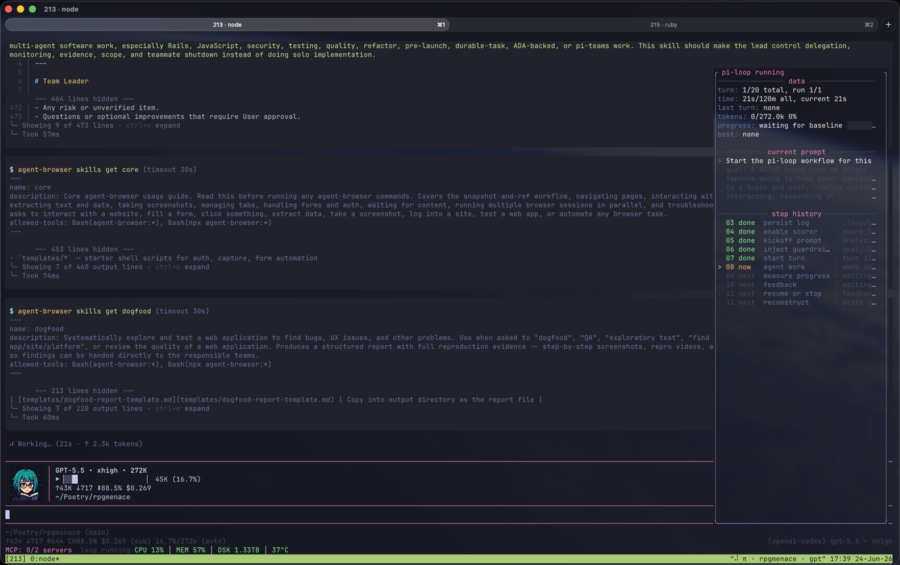

# pi-loop

`pi-loop` is a Pi extension for bounded, progress-guided software engineering loops. The first lightweight feedback turn becomes the hidden baseline; later turns use scoring as feedback and keep exploring until configured safety limits or the user stops the loop. Continuation prompts can enrich the next attempt with a compact ACE playbook from `pi-ace-adapter` when project ACE storage is enabled.

It is meant for quality work where “looks done” is not enough: test improvement, refactors, Rails hardening, verification cleanup, review-gate fixes, and similar engineering tasks.

## Screenshot



## What the package installs

This package registers pi-loop plus the bundled ACE adapter resources:

```json
{
  "pi": {
    "extensions": [
      "./node_modules/pi-ace-adapter/dist/index.js",
      "./extensions/pi-loop/index.ts"
    ],
    "skills": ["./node_modules/pi-ace-adapter/skills"],
    "prompts": ["./node_modules/pi-ace-adapter/prompts"]
  }
}
```

The extensions add:

| Surface | Name | Purpose |
| --- | --- | --- |
| Command | `/loop` | Starts, stops, clears, and reports loop status. |
| Tool | `loop_feedback` | Records a tiny turn checkpoint; pi-loop scores from target context and existing tool history, not a large model-supplied evidence object. |
| UI | floating right-side panel | Shows runtime data, current prompt, timing, tokens, and bounded step history. |
| State | `~/.pi/agent/pi-loop/projects/<project>/log.jsonl` | Persists loop config, internal measurements, progress entries, and stop events in Pi's global agent directory. Active loops are bound to the Pi session that started them. |

## Install

### ACE adapter dependency

This branch expects the sibling checkout `~/Poetry/pi-ace-adapter` and declares it as `pi-ace-adapter: file:../pi-ace-adapter` for local development. Keep the two checkouts side by side when installing locally. Before publishing or installing from a remote, replace that file dependency with the adapter's git or registry spec. pi-loop loads the adapter extension resources from `node_modules`, imports the stable `pi-ace-adapter/context` resolver, and launches ACE through the adapter's daemon-style runner.

Local development install:

```bash
pi install ~/src/pi-loop
```

Temporary one-off run without installing:

```bash
pi -e ~/src/pi-loop
```

Use the package directory, not only `extensions/pi-loop/index.ts`, so Pi also loads the ACE adapter extension, `/ace` commands, skills, prompts, and daemon-launch event listener.

After publishing to a git remote, install with:

```bash
pi install https://github.com/<owner>/pi-loop
```

For project-local installation, run the install command from the target repository with `-l`:

```bash
pi install -l ~/src/pi-loop
```

## Commands

```text
/loop <goal>
/loop <goal> --minutes=10 --turns=12 --runs=2
/loop status
/pi-loop hide
/pi-loop show
/pi-loop toggle
/loop off
/loop clear

/ace status
/ace setup
/ace import-playbook <path> [name]
/ace use <name>
/ace start [playbook] [--mode offline|online|eval_only]
```

Shortcut: `Ctrl+Alt+L` toggles the floating panel without changing loop execution.

## ACE general-use assets

The package ships general, domain-neutral ACE assets under `ace/`:

| Path | Purpose |
| --- | --- |
| `ace/playbooks/pi-loop-general.md` | A reusable software-engineering loop playbook for bug fixes, tests, refactors, docs/config/package work, and ACE integration work. |
| `ace/datasets/general-loop-proof.jsonl` | ACE-shaped general loop examples with `context`, `question`, `target`, and `metadata.domain = general_engineering`. |
| `ace/proof/verification.json` | Saved proof metadata for the local verification commands and behaviors proven by the ACE integration work. |

These assets intentionally avoid single-domain prompts or task-specific evaluation commands. Import the playbook with `/ace import-playbook ace/playbooks/pi-loop-general.md default`, enable it with `/ace use default`, and use `/ace start default` to run the adapter's detached ACE bridge.

Defaults:

| Setting | Default |
| --- | --- |
| Timebox | 10 minutes for scored loop work and data collection (capped); spawned agents should report before the cap and partial findings carry into the next attempt. |
| Turn limit | 12 total attempts |
| Run count | 1 |

## Paper model mapped to pi-loop

`pi-loop` adapts the ComPilot paper's two-phase loop: context initialization, then iterative optimization with deterministic scoring feedback.

| Paper concept | ComPilot behavior | pi-loop equivalent |
| --- | --- | --- |
| Input program | A loop nest extracted from a source program. | A software engineering goal plus the repository state the agent inspects. |
| Context prompt | Fixed system instructions describing role, input format, output format, action space, hardware, and crash handling. | `systemPromptAddon()` plus `scoringRubricSummary()`: role, limits, scoring contract, hard rules, required evidence, and stop conditions. |
| Target loop presentation | The selected loop nest is normalized and shown to the LLM. | `/loop` builds a bounded context snapshot: cwd, package manager, package scripts, git branch/status, changed files, and recent scores. The agent still chooses the exact files to inspect. |
| Initial analysis | The LLM must analyze the loop before proposing transformations. | The kickoff prompt explicitly requires analysis of problem, files, acceptance criteria, verification, and whether scoped research or delegation is needed inside the same capped loop round. |
| Schedule proposition | The LLM proposes transformations in a structured format. | The agent states and executes its plan in normal conversation/tool use; `loop_feedback` records only a concise checkpoint so schema generation does not consume the loop. |
| Response parser | Extracts the schedule from the LLM response. | TypeBox validates a small `loop_feedback` schema while scoring derives artifacts/checks from the target context and Pi tool history. |
| Validity and legality checks | Lightweight syntax checks plus compiler legality checks. | Strict schema validation, independent evidence verification, and scoring hard caps flag or cap weak evidence and unresolved risks; pi-loop still does not formally prove arbitrary code safety. |
| Compiler/runtime feedback | Reports invalid, illegal, solver failure, crash, or successful speedup/slowdown. | Reports typed outcome plus progress/evidence feedback: baseline recorded, new-best progress, verifier findings, blockers, strengths, and next actions. |
| Optimization history | Feedback is appended to the dialogue so the next iteration can adapt. | Progress entries are appended to `~/.pi/agent/pi-loop/projects/<project>/log.jsonl`; continuation prompts are rebuilt as refined prompts with what was tried, what did not improve, plateau/repeat signals, best attempt to beat, blockers, next actions, budget, and compact ACE playbook context from `pi-ace-adapter` when enabled. |
| Stopping condition | Stop command or iteration limit; the framework can push past premature LLM stop attempts. | A 10-minute capped timebox for active loop work and data collection, 12-attempt global turn budget, run limit, user stop, or repeated missing feedback calls. Positive heuristic progress alone never stops the loop. |

## Runtime context steps

1. `/loop <goal>` parses command input into a loop config: goal, max turns, max runs, and max minutes.
2. pi-loop builds a bounded context snapshot from the current working directory, package scripts, git state, changed files, and prior feedback attempts.
3. The kickoff instructions allow bounded research and delegation only inside the same capped loop round. Spawned agents should get explicit report deadlines before the 10-minute cap; at timeout, the loop should capture final or partial findings, score the current evidence, and carry remaining research into the next attempt.
4. The config plus context snapshot and current Pi session id are appended to `~/.pi/agent/pi-loop/projects/<project>/log.jsonl` as a `config` entry.
5. `loop_feedback` is activated for the session.
6. pi-loop requests a daemon-ish ACE run through `pi-ace-adapter` when ACE storage is enabled and the selected playbook exists. The loop does not wait for ACE completion; output and metadata paths are logged.
7. A kickoff prompt is sent as a normal user message. It includes the context snapshot, compact ACE context when enabled, and asks the agent to analyze first, use bounded research/delegation when useful, then work, then record lightweight feedback.
8. On every `before_agent_start`, pi-loop injects a system prompt add-on containing the active goal, context snapshot, limits, scoring hard rules for the work itself, and bounded delegation rules.
9. On `agent_start`, pi-loop increments the turn counter, appends a `turn_started` event, and records how many score entries existed before the turn.
10. The agent works with normal Pi tooling. pi-loop does not sandbox tools or prescribe the implementation path, and spawned-agent data collection remains part of the same loop cap.
11. Before claiming completion, the agent must call `loop_feedback` with only a concise `summary`, `status`, `notes`, and optional short `nextActions`.
12. The feedback tool freezes the loop timer, infers evidence from the target context and current Pi tool history, classifies the outcome, appends a progress entry to `~/.pi/agent/pi-loop/projects/<project>/log.jsonl`, updates the widget, and returns progress feedback. The first call records only the baseline.
13. On `agent_end`, pi-loop checks whether the turn produced feedback:
    - if not, it schedules a missing-feedback prompt
    - it schedules a refined continuation prompt using tried actions, non-improvements, plateau/repeat analysis, blockers, next actions, remaining budget, and compact ACE context when enabled
    - if a safety limit is hit, it appends a stop event, sends a concise TL;DR summary with each loop step taken, disables the feedback tool, and clears the widget
14. On the next event in the same Pi session, pi-loop reconstructs active state from `~/.pi/agent/pi-loop/projects/<project>/log.jsonl` and resumes the widget/tool state when limits have not been reached. A different Pi session ignores that active loop and must start its own `/loop`.

## Input structure

There are two inputs: the command input and the lightweight feedback input.

### `/loop` command input

```text
/loop <goal> [--minutes=10] [--turns=12] [--runs=1]
/loop <goal> [--file=path] [--symbol=Name] [--check="pnpm test tests/foo.test.mjs"]
```

Parsed config:

```ts
{
  goal: string;
  maxMinutes: number;
  maxTurns: number;
  maxRuns: number;
  startedAt: number;
  sessionId: string;
  targetContext: TargetContextSnapshot;
}
```

`--turns` is per run when `--runs > 1`, but it is capped at 12 and `runs * turns` must stay within the 12-attempt global safety cap. `--minutes` remains a global timebox across scored loop work and data collection and is capped at 10 minutes. Spawned agents should report before that cap; partial research should be scored honestly and moved to the next attempt instead of stretching the turn. `--runs` is capped at 5.

### `loop_feedback` tool input

The feedback input is intentionally tiny. The model should not restate artifacts, test matrices, design evidence, Rails safety, audit output, or review-gate details here. Those signals come from normal work performed during the turn: target context, file/tool history, bash check results, and final refinement.

```ts
{
  summary?: string;
  status?: "continue" | "blocked" | "ready_for_review";
  notes?: string;
  nextActions?: string[];
}
```

Field meanings:

| Field | Purpose |
| --- | --- |
| `summary` | Concise human checkpoint for the turn. |
| `status` | Whether the turn should continue, is blocked, or is ready for final review/refinement. |
| `notes` | Optional blocker, handoff, or next-step note. |
| `nextActions` | Optional short actions for the next refined prompt. |

The internal scorer still applies hard caps, but it builds the scoring input internally from existing context and tool history instead of asking the model to generate a huge schema every turn.

## Output structure

### Tool response

`loop_feedback` returns human-readable text plus structured details.

Text response shape:

```text
Progress: <baseline recorded|+N.N% over baseline> (<baseline recorded; continue|new best recorded; continue|continue>)
Outcome: <typed outcome>
Blockers:
- <severity>: <message>
Verifier findings:
- <severity>: <message>
Next actions:
- <action>
```

Structured details keep internal measurement fields for persistence and automated checks; the UI and text response do not render those fields. `passedDefinition` is retained as a compatibility field for new-best feedback and is not a loop stop command.

```ts
{
  result: {
    score: number;
    rawScore: number;
    targetScore: number;
    baselineScore: number | null;
    progressPercent: number | null;
    passedDefinition: boolean;
    improvement: number | null;
    categories: Array<{ key: string; label: string; score: number; max: number; evidence: string[]; gaps: string[] }>;
    blockers: Array<{ severity: "blocker" | "important" | "minor"; message: string; evidence?: string }>;
    strengths: string[];
    nextActions: string[];
    outcome: "invalid_evidence" | "verification_failed" | "review_gate_failed" | "safety_blocked" | "tool_or_runtime_failure" | "successful_improvement" | "successful_no_improvement" | "needs_iteration";
    verifierFindings: Array<{ code: string; severity: "blocker" | "important" | "minor"; message: string; evidence?: string; cap: number }>;
  };
  loopState: {
    active: boolean;
    goal: string | null;
    targetScore: number;
    maxTurns: number;
    maxMinutes: number;
    startedAt: number | null;
    turnsStarted: number;
    results: unknown[];
    stopReason: string | null;
  };
}
```

### Persistent log output

`~/.pi/agent/pi-loop/projects/<project>/log.jsonl` stores three entry kinds:

```ts
{ type: "config"; schemaVersion?: 2; goal: string; targetScore: number; maxTurns: number; maxMinutes: number; maxRuns?: number; startedAt: number; sessionId?: string; targetContext?: TargetContextSnapshot }
{ type: "score"; schemaVersion?: 2; run?: number; turn: number; globalTurn?: number; timestamp: number; summary: string; score: number; rawScore: number; targetScore: number; baselineScore?: number | null; progressPercent?: number | null; passedDefinition: boolean; improvement: number | null; blockers: unknown[]; strengths?: string[]; nextActions: string[]; categories: unknown[]; outcome?: string; verifierFindings?: unknown[]; attempt?: unknown; result?: unknown }
{ type: "event"; schemaVersion?: 2; timestamp: number; event: "stopped" | "run_started" | "run_stopped" | "turn_started" | "missing_score" | "premature_stop" | "ace_run_started" | "ace_run_completed" | "ace_run_failed" | "ace_run_skipped"; reason?: string; run?: number; turn?: number; globalTurn?: number; details?: Record<string, unknown> }
```

### UI output

The floating right-side panel renders at 25% terminal width and 95% terminal height. It shows runtime data, a current prompt section summarized into useful execution news (`Now`, `Signal`, `Plan`, `Budget`, `Expected`) instead of raw “continue the loop” boilerplate, recent turn durations that wrap across lines instead of truncating, and the full runtime step history so the README model is visible while the loop runs. Toggle the panel with `Ctrl+Alt+L`, `/pi-loop hide`, `/pi-loop show`, or `/pi-loop toggle`:

```text
╭──────────── pi-loop <status> ────────────╮
│──────────── data ────────────            │
│turn: <total>/<limit> total, run <n>/<max> │
│time: <elapsed>/<limit>m all, current <n> │
│last turn: <duration|none>                │
│tokens: <used>/<window> <percent>         │
│progress: <baseline|+N.N% over baseline>  │
│best: <+N.N% over baseline run n|none>    │
│ace: <not launched|running pid n|skipped> │
│recent: #1 9m 12s, #2 8m 03s             │
│        #3 10m 00s, #4 2m 17s            │
│──────── current prompt ────────          │
│Now: continue the loop with a concrete    │
│     plan for <goal>                      │
│Signal: <last progress or baseline>       │
│Plan: <next action to try>                │
│Expected: finish one verifiable slice...  │
│──────── step history ────────            │
│  07 done  start turn - turn <n>/<max>    │
│> 08 now   agent work - work in progress  │
│. 09 next  measure progress - waiting...  │
│. 10 next  feedback - waiting...          │
╰──────────────────────────────────────────╯
```

The runtime step table is the live version of the core loop orchestration steps: `/loop status` prints all 12 steps, and the panel shows all 12 steps in its expanded layout. ACE launch status is shown separately in the `ace` data row and in `ace_run_*` log events because ACE runs daemon-style outside the LLM turn lifecycle. `done` is only for completed past steps; future steps render as `next`/waiting until the active step advances. The floating panel carries loop progress while Pi's footer remains reserved for Pi status. When the loop finishes, pi-loop clears the widget and sends a concise TL;DR message covering what was accomplished plus the steps taken in each loop turn.

### Sequential best-of-K runs

`--runs=K` starts bounded sequential attempts in the same Pi session. This is not a statistically independent restart like the paper's fresh best-of-K runs, but it gives pi-loop a safe best-of-K analogue without spawning agents, forking sessions, or running parallel edits.

Behavior:

1. Run 1 starts with the normalized target context.
2. If a run reaches its turn limit, pi-loop appends `run_stopped`, starts the next run, and asks for a genuinely different plan.
3. Scoring improvements are retained as best-so-far feedback but do not stop remaining runs.
4. If all runs exhaust, the stop reason reports the best progress and run.
5. `/loop off` stops all runs.

### Premature-stop handling

If a turn ends without `loop_feedback`, pi-loop appends a `missing_score` event (legacy internal event name) and asks the agent to record lightweight feedback before doing more work. If the agent appears to claim completion before a configured stop point, pi-loop appends `premature_stop` and treats the completion claim as rejected, even if the latest score is a new best.

## Initial example

Start Pi in a repository, then run:

```text
/loop Improve the CartCalculator discount tests so they prove behavior without mocking owned code --minutes=10 --turns=8
```

Expected first turn:

1. The agent identifies the affected production and test files.
2. It maps acceptance criteria, for example:
   - discounts are applied for eligible carts
   - ineligible carts keep the original total
   - owned code is not mocked
   - the changed behavior is covered by observable assertions
3. It edits or adds tests.
4. It runs verification, for example:

```bash
pnpm test tests/cart-calculator.test.mjs
pnpm typecheck
```

5. It calls `loop_feedback` with a tiny checkpoint like this:

```json
{
  "summary": "Added behavior tests for eligible and ineligible cart discounts without mocking owned code.",
  "status": "ready_for_review",
  "notes": "targeted tests and typecheck passed; carry any remaining review-gate hardening into final refinement",
  "nextActions": ["run the remaining configured checks if the loop continues"]
}
```

The detailed evidence stays in the transcript and tool history: file edits, check commands, outputs, spawned-agent reports, and final refinement notes. `loop_feedback` freezes the loop timer and lets pi-loop score that existing context without making the model emit a large evidence payload.

Possible first response:

```text
Progress: baseline recorded (baseline recorded; continue)
Outcome: needs_iteration
Blockers:
- important: Non-trivial executable change has no automated review gate evidence.
Next actions:
- Baseline recorded; run another loop turn and use feedback to explore a better attempt.
- Automated review gates: No security or dependency review gate evidence was provided.
```

The next turn starts from that feedback. The agent might run full CI-equivalent checks, add missing edge coverage, or resolve a blocker. The extension does not stop on heuristic satisfaction; it keeps exploring until the configured limits or a user stop.

## Internal measurement model

The evidence contract is exposed through `extensions/pi-loop/scoring-heuristics.ts`. Agents and external checker integrations should import that facade as the source of truth. The implementation is split by responsibility under `extensions/pi-loop/scoring/`.

Hard-cap rule files live under `extensions/pi-loop/scoring/rules/`. A custom integration can create a `RuleRegistry`, call `.load(customRule)`, and pass that registry to `scoreLoopResult(input, registry)`.

```ts
import { RuleRegistry, scoreLoopResult } from "./extensions/pi-loop/scoring-heuristics.ts";

const registry = new RuleRegistry()
  .load(myTeamRule)
  .load(mySecurityRule);

const result = scoreLoopResult(input, registry);
```

Default built-in rule families:

```text
requirements
attempt
verification
test-quality
review-gates
rails-safety
design-solid
operability
risks
contradictions
```

Internal category weights:

| Category | Points |
| --- | ---: |
| Correctness | 20 |
| Testing quality | 20 |
| Design and SOLID | 18 |
| Rails engineering | 15 |
| Verification and gates | 12 |
| Automated review gates | 10 |
| Operational hardening | 5 |

Hard caps lower the internal measurement when requirements are missing, inferred artifacts are absent or unverifiable, verification is missing, review gates are missing or failed, tests are mock-only, owned code is mocked, tests are implementation-coupled, mock status is unstated, Rails evidence contradicts touched paths, critical security/auth/data risks remain unresolved, or loop behavior is unbounded. The user-facing loop progress is still only percent improvement over the first feedback attempt.

## Runtime diagram

```text
PHASE 1: CONTEXT INITIALIZATION

User
  |
  | /loop <goal> --minutes=N --turns=N --runs=N
  v
+-----------------------+
| /loop command parser  |
| parseLoopArgs()       |
+-----------------------+
  |
  | parsed goal + limits
  v
+-----------------------------+
| Context initializer         |
| buildTargetContextSnapshot()|
| files, symbols, checks, git |
+-----------------------------+
  |
  | context snapshot
  v
+-----------------------+
| Runtime state         |
| startLoopState()      |
+-----------------------+
  |
  +----------------------------+
  |                            |
  | config + context entry     | active feedback tool
  v                            v
+-----------------------+    +--------------------------+
| ~/.pi/agent/pi-loop/... |  | loop_feedback tool       |
| append config         |    | enabled for this session |
+-----------------------+    +--------------------------+
  |
  | kickoffPrompt(state)
  v
+--------------------------------------------------+
| Agent receives context                           |
| - goal                                           |
| - time/turn/run budget                           |
| - context snapshot                               |
| - evidence contract                              |
| - hard rules                                     |
| - instruction to analyze before implementation   |
+--------------------------------------------------+


PHASE 2: ITERATIVE OPTIMIZATION LOOP

+--------------------------------------------------+
| before_agent_start                               |
| inject systemPromptAddon(state)                  |
+--------------------------------------------------+
  |
  v
+--------------------------------------------------+
| Agent turn                                       |
| - inspect files                                  |
| - map requirements                               |
| - state a plan in normal prose                   |
| - edit / investigate                             |
| - run real checks                                |
| - leave evidence in tool history                 |
+--------------------------------------------------+
  |
  | tiny summary/status checkpoint
  v
+--------------------------------------------------+
| loop_feedback                                    |
| TypeBox validates tiny input schema              |
| freezes loop timer for post-processing           |
+--------------------------------------------------+
  |
  v
+--------------------------------------------------+
| build internal score input + scoreLoopResult()   |
| - infer artifacts/checks from context/history    |
| - independent evidence verifier                  |
| - internal category measurements                 |
| - plug/play rule files                           |
| - hard caps                                      |
| - blockers                                      |
| - typed outcome                                  |
| - verifier findings                             |
| - next actions                                  |
| - progress vs first feedback baseline            |
+--------------------------------------------------+
  |
  +----------------------------+-------------------+
  |                            |
  | progress entry             | visible feedback
  v                            v
+-----------------------+    +--------------------------+
| ~/.pi/agent/pi-loop/... |  | Floating side panel     |
| append progress/outcome|   | data / prompt / history |
+-----------------------+    +--------------------------+
  |
  v
+--------------------------------------------------+
| Stop check                                       |
| - timebox reached                                |
| - current run turn limit reached                 |
| - all runs exhausted                             |
| - user ran /loop off                             |
| - repeated missing feedback calls                |
+--------------------------------------------------+
  |
  +-------------+----------------------+----------------+
  | finish      | next run available   | continue same run
  v             v                      v
+-------------+ +--------------------+ +------------------------------+
| finishLoop  | | run_stopped event  | | continuePrompt(state)        |
| stop event  | | run_started event  | | compact feedback history     |
+-------------+ | nextRunPrompt      | | blockers + next actions      |
                +--------------------+ +------------------------------+
                         |                         |
                         v                         v
                    next agent turn           next agent turn


PLUG/PLAY RULE LOADER

scoreLoopResult(input, registry?)
  |
  v
+--------------------------+
| RuleRegistry             |
| .load(rule)              |
| .evaluate(input)         |
+--------------------------+
  |
  +--> requirements.ts
  +--> attempt.ts
  +--> verification.ts
  +--> test-quality.ts
  +--> review-gates.ts
  +--> rails-safety.ts
  +--> design-solid.ts
  +--> operability.ts
  +--> risks.ts
  +--> contradictions.ts
  |
  v
hard caps + blocker reasons


SESSION RESTORE

Pi session_start
  |
  v
+--------------------------+
| reconstructLoopState()   |
| read ~/.pi/agent/pi-loop |
| replay config + scores   |
+--------------------------+
  |
  +--> if active and limits not reached: restore widget + feedback tool
  +--> otherwise: stay stopped
```

## Repository layout

```text
extensions/pi-loop/index.ts                  extension entrypoint
extensions/pi-loop/target-context.ts         normalized target context snapshot
extensions/pi-loop/feedback-history.ts       compact score-history feedback
extensions/pi-loop/premature-stop.ts         completion-claim detection
extensions/pi-loop/run-manager.ts            sequential best-of-K run helpers
extensions/pi-loop/controller.ts             loop lifecycle orchestration
extensions/pi-loop/events.ts                 Pi lifecycle event handlers
extensions/pi-loop/loop-command.ts           /loop command registration
extensions/pi-loop/score-tool.ts             loop_feedback registration and internal score-input builder
extensions/pi-loop/tool-schema.ts            lightweight feedback tool input schema
extensions/pi-loop/state.ts                  runtime state transitions
extensions/pi-loop/log.ts                    ~/.pi/agent/pi-loop/projects persistence
extensions/pi-loop/ui.ts                     floating right-side progress panel
extensions/pi-loop/scoring-heuristics.ts     public scoring facade
extensions/pi-loop/scoring/evidence-verifier.ts independent evidence checks
extensions/pi-loop/scoring/outcome.ts        typed paper-style feedback outcomes
extensions/pi-loop/scoring/rules/            plug/play hard-cap rule files
tests/                                       behavior and scoring tests
```

Source and test modules are kept under roughly 200 lines to avoid god files.

## Development

```bash
pnpm install
pnpm check
pnpm smoke
```

Individual commands:

```bash
pnpm test
pnpm typecheck
pi --mode json --no-session --no-extensions -e ./extensions/pi-loop/index.ts -p '/loop status'
```

## Runtime files

`pi-loop` writes runtime state only under Pi's global agent directory:

```text
~/.pi/agent/pi-loop/projects/<project>/log.jsonl
```

Delete the global log manually or run `/loop clear` to remove loop state.
